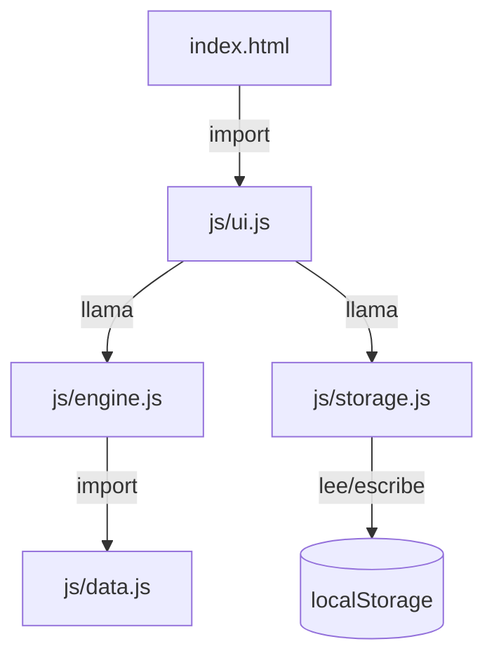
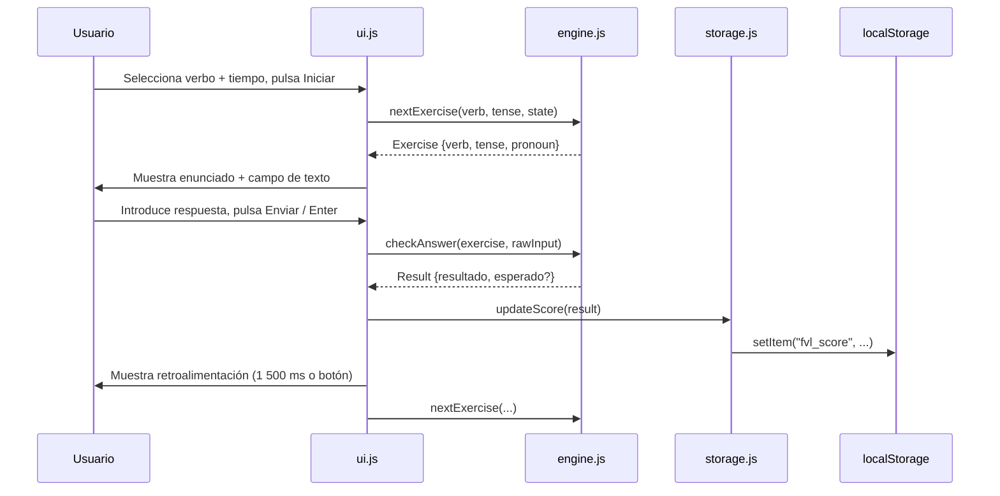

# Documento de Diseño Técnico — French Verb Lab

## Overview

French Verb Lab es una aplicación web estática de una sola página (SPA sin router) para practicar la conjugación de verbos en francés. El estudiante selecciona un verbo y un tiempo verbal, responde preguntas de conjugación, recibe retroalimentación inmediata y consulta su puntuación acumulada entre sesiones.

La aplicación se sirve íntegramente como archivos estáticos (`index.html`, CSS, JS en ES modules) desde S3 + CloudFront, sin servidor de aplicaciones, sin API y sin proceso de compilación. Todo el estado efímero vive en memoria; el estado persistente (puntuación) vive en `localStorage`.

### Objetivos de diseño

- **Separación de responsabilidades estricta**: datos, lógica, almacenamiento y UI son módulos independientes con interfaces explícitas.
- **Testabilidad sin DOM**: `engine.js` contiene únicamente funciones puras, importable directamente en Node.js.
- **Accesibilidad desde el primer commit**: HTML semántico, etiquetas en francés, contraste WCAG 2.1 AA.
- **Sin dependencias externas**: cero librerías de terceros; el bundle de producción son los archivos fuente sin transpilación.

---

## Architecture

### Diagrama de módulos



> `ui.js` es el único módulo que toca el DOM. `engine.js` y `data.js` son independientes del entorno de ejecución. `storage.js` encapsula toda la interacción con `localStorage`.

### Flujo de datos en tiempo de ejecución



### Restricciones de dependencia

| Módulo | Puede importar | No puede importar |
|---|---|---|
| `data.js` | — | `engine`, `storage`, `ui`, DOM |
| `engine.js` | `data.js` | `storage`, `ui`, DOM, `localStorage` |
| `storage.js` | — | `engine`, `ui`, DOM |
| `ui.js` | `engine.js`, `storage.js` | `data.js` directo (accede via engine) |

---

## Components and Interfaces

### `data.js`

Exporta un único objeto `VERBS` con estructura indexada por infinitivo y tiempo verbal. También exporta las constantes `VERB_LIST` y `TENSE_LIST` para poblar los selectores de la UI.

```js
// Interfaz pública
export const VERB_LIST   // string[]  — 12 infinitivos
export const TENSE_LIST  // string[]  — 4 tiempos verbales
export const VERBS       // Record<Infinitive, Record<Tense, Conjugations>>

// Tipo Conjugations
// { je, tu, "il/elle", nous, vous, "ils/elles" }  — 6 formas exactas
```

La validación de integridad (¿están las 6 formas para cada combinación?) se ejecuta en tiempo de carga del módulo: si alguna falta, lanza un `Error` con el verbo y el tiempo afectados antes de exportar nada.

### `engine.js`

Toda la lógica de negocio sin estado global: recibe datos como parámetros y devuelve nuevos valores.

```js
// Tipos
/**
 * @typedef {{ verb: string, tense: string, pronoun: string }} Exercise
 * @typedef {{ resultado: 'correcto' | 'incorrecto', esperado?: string }} Result
 * @typedef {{ used: string[], lastPronoun: string | null }} CycleState
 */

// Interfaz pública
export function createCycleState()
// () => CycleState  — estado inicial de ciclo vacío

export function nextExercise(verb, tense, cycleState)
// (string, string, CycleState) => { exercise: Exercise, nextState: CycleState }
// Selecciona aleatoriamente un pronombre no usado; al completar ciclo, reinicia
// evitando que el primer pronombre del nuevo ciclo coincida con el último del anterior.

export function checkAnswer(exercise, rawInput)
// (Exercise, string) => Result
// Normaliza rawInput (trim + toLowerCase) y compara con la forma canónica de VERBS.
// Preserva acentos; entrada vacía/solo-espacios devuelve resultado:'incorrecto'.
```

`engine.js` no usa `Math.random` directamente; recibe un parámetro opcional `rng` (por defecto `Math.random`) para facilitar pruebas deterministas.

### `storage.js`

```js
// Tipo Score
// { correct: number, total: number }

export function loadScore()
// () => Score  — lee de localStorage; devuelve {correct:0, total:0} si no existe

export function saveScore(score)
// (Score) => void  — persiste en localStorage inmediatamente

export function resetScore()
// () => void  — escribe {correct:0, total:0} en localStorage

// Clave interna: 'fvl_score'  (no exportada)
```

`storage.js` captura excepciones de `localStorage` (modo privado, cuota excedida) y las registra en `console.warn` sin propagar errores al llamador.

### `ui.js`

Módulo de arranque: registra listeners, renderiza el DOM inicial y coordina los demás módulos.

```js
// Funciones internas principales (no exportadas)
function initSelectors()      // puebla <select> de verbos y tiempos
function startSession()       // valida selección, llama nextExercise, muestra enunciado
function submitAnswer()       // llama checkAnswer, showFeedback, scheduleNext
function showFeedback(result) // renderiza zona de retroalimentación
function scheduleNext()       // setTimeout 1500ms + botón continuar (race)
function updateScoreDisplay() // lee score y actualiza el contador visible
```

El único punto de entrada externo es el evento `DOMContentLoaded`.

---

## Data Models

### Estructura de `VERBS`

```js
const VERBS = {
  "être": {
    "présent": {
      "je":         "suis",
      "tu":         "es",
      "il/elle":    "est",
      "nous":       "sommes",
      "vous":       "êtes",
      "ils/elles":  "sont"
    },
    "passé composé": {
      "je":         "ai été",
      // ...
    },
    // imparfait, futur simple
  },
  "avoir": { /* ... */ },
  // 10 verbos más
}
```

### Estado del ciclo (`CycleState`)

```js
{
  used: ["je", "tu"],         // pronombres ya usados en el ciclo actual
  lastPronoun: "tu"           // último pronombre presentado (anti-colisión entre ciclos)
}
```

El ciclo se completa cuando `used.length === 6`. Al reiniciar, `used` se vacía y `lastPronoun` se conserva para evitar repetición inmediata.

### Objeto `Result`

```js
// Respuesta correcta
{ resultado: "correcto" }

// Respuesta incorrecta o vacía
{ resultado: "incorrecto", esperado: "sont" }
```

### Puntuación en `localStorage`

```json
{ "correct": 14, "total": 20 }
```

Clave: `"fvl_score"`. El objeto se serializa con `JSON.stringify` y se deserializa con `JSON.parse`.

### Estructura HTML de la página

```
<body>
  <header>          — título de la app
  <main>
    <section>       — panel de selección (selectores + botón iniciar)
    <section>       — panel de ejercicio (enunciado + input + botón enviar)
    <section>       — panel de retroalimentación (icono + mensaje + botón continuar)
    <aside>         — marcador "X correctas / Y intentos" + botón reinicio
  </main>
  <footer>          — créditos / info
</body>
```

---

## Correctness Properties

*Una propiedad es una característica o comportamiento que debe mantenerse verdadero en todas las ejecuciones válidas del sistema — esencialmente, un enunciado formal sobre lo que el sistema debe hacer. Las propiedades sirven como puente entre las especificaciones legibles por humanos y las garantías de corrección verificables automáticamente.*

### Property 1: Completitud del catálogo por combinación

*Para toda* combinación (verbo, tiempo verbal) presente en `VERBS`, el objeto de conjugaciones asociado debe contener exactamente las seis claves `["je", "tu", "il/elle", "nous", "vous", "ils/elles"]` y ninguna clave adicional.

**Validates: Requirements 1.2**

---

### Property 2: Sin repetición de pronombre dentro del ciclo

*Para cualquier* verbo e tiempo verbal válidos, una secuencia de seis llamadas consecutivas a `nextExercise` con el mismo estado inicial de ciclo debe producir exactamente los seis pronombres distintos, sin ninguna repetición.

**Validates: Requirements 2.2**

---

### Property 3: Anti-colisión entre ciclos

*Para cualquier* verbo y tiempo verbal válidos, el pronombre devuelto por la primera llamada a `nextExercise` tras completar un ciclo de seis no debe coincidir con el pronombre devuelto en la sexta llamada del ciclo anterior.

**Validates: Requirements 2.3**

---

### Property 4: Normalización no penaliza espaciado ni capitalización

*Para cualquier* ejercicio válido y cualquier respuesta correcta con variantes arbitrarias de espacios iniciales/finales y capitalización, `checkAnswer` debe devolver `{ resultado: "correcto" }`.

**Validates: Requirements 4.1, 4.3, 9.3**

---

### Property 5: Los acentos son obligatorios

*Para cualquier* forma conjugada del catálogo que contenga al menos un carácter acentuado, proporcionar la misma cadena con ese acento eliminado o sustituido por el carácter base debe producir `{ resultado: "incorrecto", esperado: <forma canónica> }`.

**Validates: Requirements 4.2**

---

### Property 6: Respuesta incorrecta devuelve la forma canónica intacta

*Para cualquier* ejercicio válido y cualquier cadena de entrada que difiera de la forma canónica tras normalización, `checkAnswer` debe devolver `{ resultado: "incorrecto", esperado: <formaCanónica> }` donde `esperado` es idéntico byte a byte a la forma almacenada en `VERBS` (conservando tildes y caracteres especiales).

**Validates: Requirements 4.4, 9.4**

---

### Property 7: Entrada vacía o solo espacios siempre es incorrecta

*Para cualquier* ejercicio válido y cualquier cadena de entrada compuesta únicamente de cero o más caracteres de espacio en blanco (`\s`), `checkAnswer` debe devolver `{ resultado: "incorrecto", esperado: <formaCanónica> }` sin realizar ninguna comparación con el catálogo.

**Validates: Requirements 4.5, 9.5**

---

### Property 8: Round-trip de puntuación en localStorage

*Para cualquier* objeto `Score { correct: N, total: M }` con N ≥ 0 y M ≥ N, una llamada a `saveScore(score)` seguida inmediatamente de `loadScore()` debe devolver un objeto con los mismos valores `correct` y `total`.

**Validates: Requirements 6.2, 6.3**

---

### Property 9: Reinicio borra la puntuación

*Para cualquier* objeto `Score` con valores positivos persistido en `localStorage`, una llamada a `resetScore()` seguida de `loadScore()` debe devolver `{ correct: 0, total: 0 }`.

**Validates: Requirements 6.7**

---

## Error Handling

### Errores en tiempo de carga de `data.js`

Si el catálogo exportado tiene alguna forma personal faltante para una combinación (verbo, tiempo), el módulo lanza un `Error` descriptivo antes de exportar `VERBS`:

```js
// Ejemplo de mensaje
"data.js: faltan formas para 'être' / 'passé composé': falta 'nous'"
```

Esto evita que la aplicación arranque con datos incompletos y convierte errores silenciosos en fallos rápidos y visibles durante el desarrollo.

### Errores de `localStorage` en `storage.js`

`localStorage` puede fallar en modo de navegación privada o cuando la cuota está llena. `storage.js` envuelve todas las operaciones en `try/catch`:

- Si `setItem` falla, se registra `console.warn` con el error pero la sesión continúa (la puntuación se perderá al recargar).
- Si `getItem` falla o devuelve JSON inválido, se devuelve la puntuación por defecto `{ correct: 0, total: 0 }`.

### Resultado inesperado del motor en `ui.js`

Si `checkAnswer` devuelve un `resultado` distinto de `"correcto"` o `"incorrecto"` (defensa ante cambios futuros), `ui.js` no actualiza la puntuación ni avanza al siguiente ejercicio, y registra `console.error`.

### Selección incompleta en la UI

Si el estudiante confirma el inicio sin haber seleccionado verbo, tiempo o ambos, la UI muestra un mensaje de error en francés dentro de la sección de selección sin modificar el estado del ejercicio activo.

---

## Testing Strategy

### Enfoque dual: ejemplos + propiedades

La lógica de `engine.js` y `storage.js` es pura o casi-pura, lo que las hace ideales para property-based testing. La UI (`ui.js`) se prueba con tests de ejemplo usando JSDOM.

### Biblioteca de property-based testing

Se usará **[fast-check](https://fast-check.dev/)** (MIT, ampliamente mantenida, compatible con ESM y Node.js 18+). Es la única dependencia de desarrollo del proyecto; no se incluye en el bundle de producción.

> *Justificación*: fast-check es la librería PBT más madura del ecosistema JavaScript, con soporte nativo para ESM, generadores arbitrarios personalizables y reproducibilidad mediante semillas. No hay alternativa equivalente sin dependencias externas.

### Tests de propiedades (`engine.js`, `storage.js`)

Cada test de propiedad se ejecuta con un mínimo de **100 iteraciones**. Cada test incluye un comentario de trazabilidad:

```js
// Feature: french-verb-lab, Propiedad 4: Normalización no penaliza espaciado ni capitalización
```

| Propiedad | Módulo | Generadores necesarios |
|---|---|---|
| P1: Completitud del catálogo | `data.js` | Iteración sobre VERBS (no PBT, es verificación estructural) |
| P2: Sin repetición en ciclo | `engine.js` | `fc.constantFrom(...VERB_LIST)`, `fc.constantFrom(...TENSE_LIST)`, `fc.integer` como semilla |
| P3: Anti-colisión entre ciclos | `engine.js` | Mismo que P2 |
| P4: Normalización espaciado/capitalización | `engine.js` | `fc.constantFrom(...formasCanónicas)`, `fc.string` para padding, `fc.boolean` para uppercase |
| P5: Acentos obligatorios | `engine.js` | `fc.constantFrom(...formasConAcento)`, transformador que elimina diacríticos |
| P6: Respuesta incorrecta devuelve canónica | `engine.js` | `fc.string()` filtrado para excluir formas correctas |
| P7: Vacío/espacios siempre incorrecto | `engine.js` | `fc.stringOf(fc.constant(' '))` |
| P8: Round-trip puntuación | `storage.js` | `fc.nat()` para correct, `fc.nat()` para total (con filtro M ≥ N) |
| P9: Reinicio borra puntuación | `storage.js` | `fc.nat()` para correct y total |

### Tests de ejemplo (`ui.js`, accesibilidad, integración)

- **Inicialización de selectores**: verificar que los `<select>` contienen 12 verbos y 4 tiempos.
- **Envío con Enter**: simular `keydown` con `key: 'Enter'` y verificar que se llama `submitAnswer`.
- **Campo vacío**: intentar enviar con input vacío y verificar que no se procesa.
- **Retroalimentación correcta**: verificar DOM + aria-label + actualización del contador.
- **Retroalimentación incorrecta**: verificar que DOM contiene el esperado y la respuesta del estudiante.
- **Auto-avance en 1500ms**: usar fake timers de vitest para verificar `scheduleNext`.
- **Confirmación de reinicio**: simular clic en botón de reinicio y verificar diálogo.
- **localStorage vacío → score 0/0**: llamar `loadScore()` sin datos previos.

### Runner de tests

Se usará **[Vitest](https://vitest.dev/)** (MIT, compatible con ES modules nativos, sin configuración de transpilación). Comando para CI: `vitest --run`.

> *Justificación*: Jest requiere transformación para ESM; Vitest soporta ES modules nativos sin configuración adicional, alineándose con la restricción de "sin transpilación" del proyecto.

### Cobertura mínima esperada

| Módulo | Estrategia |
|---|---|
| `data.js` | Verificación estructural (ejemplo) + smoke importación Node.js |
| `engine.js` | Property-based testing (P2–P7) + ejemplos de ciclo |
| `storage.js` | Property-based testing (P8, P9) + edge case localStorage vacío |
| `ui.js` | Tests de ejemplo con JSDOM |
| Accesibilidad | Verificación manual + axe-core en CI (opcional) |
| Despliegue | Verificaciones manuales y de linting |
